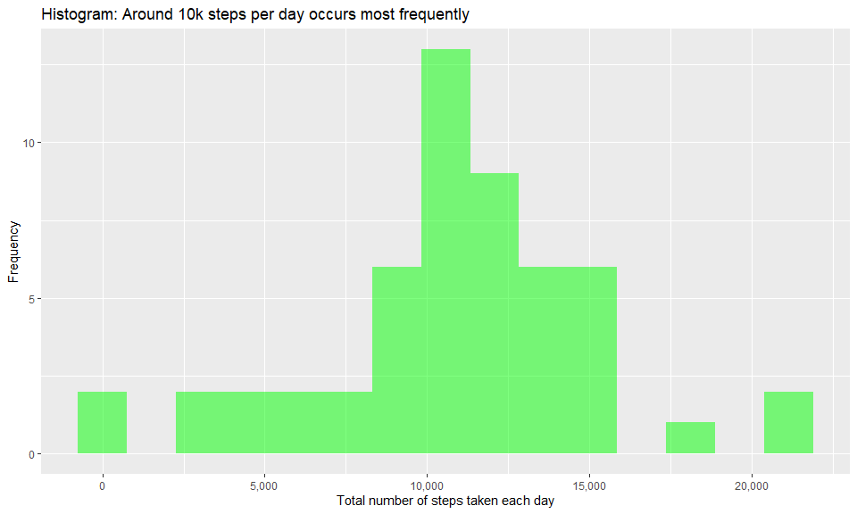
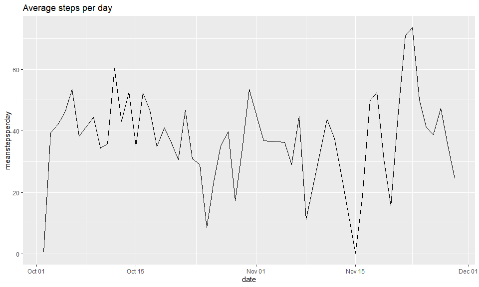
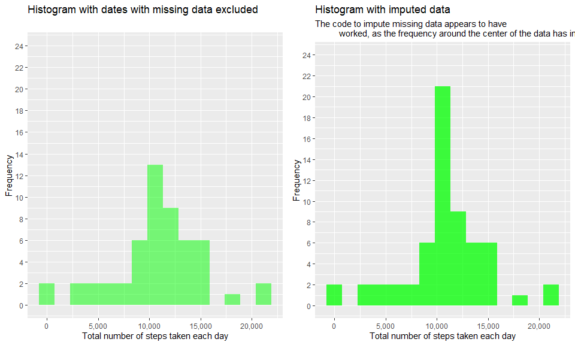
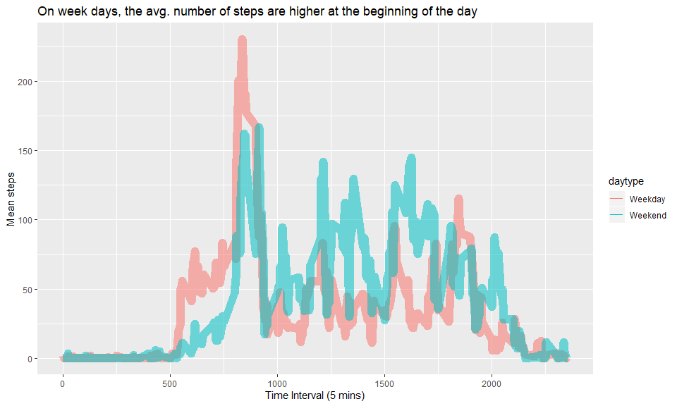

## Introduction
This is a markdown document which explains the analysis undertaken for the Coursera Reproducible Research Course Project 1.


### Assignment Tasks
1. Write code for reading in the dataset and/or processing the data
2. Create a histogram of the total number of steps taken each day
3. Calculate the Mean and median number of steps taken each day
4. Create a time series plot of the average number of steps taken
5. Find the 5-minute interval that, on average, contains the maximum number of steps
6. Write code to describe and show a strategy for imputing missing data
7. Create a histogram of the total number of steps taken each day after missing values are imputed
8. Create a panel plot comparing the average number of steps taken per 5-minute interval across weekdays and weekends


## The Assignment


### Task 1

##### Code for reading in the dataset and/or processing the data
- Download and unzip the data
- Load the data
- Initial summaries identified there are 8 days completely missing data
- Created a clean data table for the analysis


```r
########################################################################
# 1. CODE FOR READING IN THE DATASET AND/OR PROCESSING THE DATA
########################################################################
#  DOWNLOAD DATA
fileurl <- "https://d396qusza40orc.cloudfront.net/repdata%2Fdata%2Factivity.zip"
filezip <- "data/repdata_data_activity.zip"

if(!file.exists("data")){dir.create("data")} #create folder for data
if(!file.exists("figures")){dir.create("figures")} #create folder for figures
if(!file.exists(filezip)){
  download.file(fileurl,
                destfile = filezip,
                mode = "wb"
  ) +
    unzip(zipfile = filezip,exdir = "data/")# ignore the error message
}
#  LOAD DATA
data.activity <- fread("data/activity.csv")

#  PROCESS TRANSFORM DATA
data.activity$date <- ymd(data.activity$date) #change date format

#  INITIAL LOOK AT THE DATA 
names(data.activity) # Column names
```

```
## [1] "steps"    "date"     "interval"
```

```r
dim(data.activity) # The number of variables, there should be 17,568 observations in this dataset.
```

```
## [1] 17568     3
```

```r
length(unique(data.activity$date)) # the number of days = 61 days
```

```
## [1] 61
```

```r
length(unique(data.activity$date))/7 # the data is not in complete weeks
```

```
## [1] 8.714286
```

```r
head(data.activity) # what the table looks like
```

```
##    steps       date interval
## 1:    NA 2012-10-01        0
## 2:    NA 2012-10-01        5
## 3:    NA 2012-10-01       10
## 4:    NA 2012-10-01       15
## 5:    NA 2012-10-01       20
## 6:    NA 2012-10-01       25
```

```r
# We know there are records where steps = NA
md.pattern(data.activity) #2305 records with NA
```

<!-- -->

```
##       date interval steps     
## 15264    1        1     1    0
## 2304     1        1     0    1
##          0        0  2304 2304
```

```r
data.activity[is.na(steps),.(steps=length(steps)),by = c("date")] 
```

```
##          date steps
## 1: 2012-10-01   288
## 2: 2012-10-08   288
## 3: 2012-11-01   288
## 4: 2012-11-04   288
## 5: 2012-11-09   288
## 6: 2012-11-10   288
## 7: 2012-11-14   288
## 8: 2012-11-30   288
```

```r
# There are 8 dates with no data
# Omitting these dates from the initial data set 

#  CREATE DATA SET EXCLUDING DATES WITHOUT DATA
data.activity2 <-
  data.activity[!is.na(steps),
                .(
                  totalsteps = sum(steps,na.rm = TRUE),
                  meanstepsperday = mean(steps,na.rm = TRUE)
                ),
                by = c("date")
                ]
```


### Task 2

##### Create a histogram of the total number of steps taken each day
- The histogram indicates the data is relatively symetrical which means the average is a good approximation of the centre of the data.
- Around 10k steps per day occurs most frequently
- There were 8 dates completely missing data.  As the data related to complete days, it seems reasonable to exclude the dates from the charts. 


```r
########################################################################
# 2. HISTOGRAM OF THE TOTAL NUMBER OF STEPS TAKEN EACH DAY 
########################################################################
#  HISTOGRAM
chart.step2.histogram <-
  ggplot(data.activity2, aes(totalsteps))+
  geom_histogram(bins = 15, fill="green",alpha=1/2)+
  ggtitle(label="Histogram: Around 10k steps per day occurs most frequently")+ 
  scale_x_continuous(name = "Total number of steps taken each day",labels = scales::comma)+  
  scale_y_continuous(name = "Frequency")

plot(chart.step2.histogram)
```

<!-- -->

### Task 3

##### Calculate the Mean and median number of steps taken each day
- The mean number of steps taken each day is 10,766 
- The median number of steps taken each day is 10,765
- The mean and median are pretty much equal which indicates the data is relatively symmetrical.


```r
########################################################################
# 3. MEAN AND MEDIAN NUMBER OF STEPS TAKEN EACH DAY 
########################################################################

#  MEAN
print(mean(data.activity2$totalsteps,na.rm = TRUE))
```

```
## [1] 10766.19
```

```r
#  MEDIAN
print(median(data.activity2$totalsteps,na.rm = TRUE))
```

```
## [1] 10765
```


### Task 4

##### Create a time series plot of the average number of steps taken


```r
########################################################################
# 4. TIME SERIES PLOT OF THE AVERAGE NUMBER OF STEPS TAKEN
########################################################################

chart.4.timeseries <-
  ggplot(data=data.activity2, aes(x=date,y=meanstepsperday))+
  geom_line()+
  ggtitle(label="Average steps per day")
plot(chart.4.timeseries)
```

<!-- -->


### Task 5

##### Find the 5-minute interval that, on average, contains the maximum number of steps
- On average, interval 835 contains the max. number of steps (206)


```r
########################################################################
# 5. THE 5-MINUTE INTERVAL THAT ON AVERAGE CONTAINS THE MAX. # OF STEPS
########################################################################

# CREATE DATA TABLE SUMMARY
data.avg.steps <- 
  data.activity[!is.na(steps),
                .(
                  daily.mean.steps = mean(steps,na.rm = TRUE)
                ),
                by = c("interval")]

# SORT DATA BY VALUE DESCENDING ORDER
x <- data.avg.steps[order(-rank(daily.mean.steps))]
print(x[1,])
```

```
##    interval daily.mean.steps
## 1:      835         206.1698
```


### Task 6

##### Write code to describe and show a strategy for imputing missing data
- The histogram indicated the data is symetrical.  The mean for each interval may be an appropriate method to impute missing data
- In the previous task (5) we created a table containing the average number of steps for each interval
- We can use the average to impute the missing data using the follow code

```r
########################################################################
# 6. CODE TO DESCRIBE AND SHOW A STRATEGY FOR IMPUTING MISSING DATA 
########################################################################

#find the average for each interval
dim(data.avg.steps) # check to make sure there's an average for each interval (288)
```

```
## [1] 288   2
```

```r
# CREATE TABLE OF INTERVALS WITH MISSING DATA 
data.na <- data.activity[is.na(steps),2:3]
# APPLY THE INTERVAL AVERAGE TO THE MISSING DATA
data.na.imputed <- merge(data.na,data.avg.steps,by.x = 'interval',by.y = 'interval',all.x = FALSE)
# CHANGE COLUMN NAME
setnames(data.na.imputed,'daily.mean.steps','steps')
# CREATE DATA TABLE OF COMLETE OBSERVATIONS
data.activity.imputed <- data.activity[!is.na(steps)]
# REORDER COLUMNS
setcolorder(data.na.imputed,c("steps","date","interval"))
# RBIND 
data.imputed <- rbind(data.activity.imputed, data.na.imputed)
# CHECKS
dim(data.imputed) # should equal 17,568
```

```
## [1] 17568     3
```

```r
anyNA(data.imputed) # should equal 'FALSE'
```

```
## [1] FALSE
```


### Task 7

##### Create a histogram of the total number of steps taken each day after missing values are imputed
- The histograms show the data before and after imputing the missing values
- There is an increase in the most frequent result where the mean has been used to impute the missing values.


```r
#########################################################################################
# 7. HISTOGRAM OF THE TOTAL No. OF STEPS TAKEN EACH DAY AFTER MISSING VALUES ARE IMPUTED 
#########################################################################################
# 
#  CREATE TABLE SUMMARISED BY DAY WITH IMPUTED DATA
data.imputed.summarised.byday <-
  data.imputed[,
               .(
                 totalsteps = sum(steps)
               ),
               by=c("date"
               )]

# #  CHART TO SENSE CHECK THE DATA (VOLUME BY DAY)
# chart.sense.check.imputed.data <-  
# ggplot(data.imputed.summarised.byday)+
#   aes(x=date,y=totalsteps)+
#   stat_summary(fun.y = sum, geom = "bar")+
#   ggtitle("The chart shows there are now no days with missing data",
#           subtitle = "(data imputed using average steps per interval)")+
#   scale_x_date(name = "Date")+
#   scale_y_continuous(name = "Sum of steps by day")
# plot(chart.sense.check.imputed.data)
  
    
#  HISTOGRAM WITH IMPUTED DATA FOR MISSING VALUES
chart.histogram.imputed <-
  ggplot(data.imputed.summarised.byday, aes(totalsteps))+
  geom_histogram(bins = 15, fill="green",alpha=3/4)+
  ggtitle(label="Histogram with imputed data", 
          subtitle = "The code to impute missing data appears to have
          worked, as the frequency around the center of the data has increased")+
  scale_x_continuous(name = "Total number of steps taken each day",labels = scales::comma)+  
  scale_y_continuous(name = "Frequency",breaks = seq(0,24, by = 2),limits = c(0,24))

#  HISTOGRAM OF DATA EXCLUDING MISSING DATA
chart.histogram.excluding.missingvalues <-
  ggplot(data.activity2, aes(totalsteps))+
  geom_histogram(bins = 15, fill="green",alpha=1/2)+
  ggtitle(label="Histogram with dates with missing data excluded", 
          subtitle = "")+
  scale_x_continuous(name = "Total number of steps taken each day",labels = scales::comma)+  
  scale_y_continuous(name = "Frequency",breaks = seq(0,24, by = 2),limits = c(0,24))

grid.arrange(chart.histogram.excluding.missingvalues,chart.histogram.imputed,ncol=2)
```

<!-- -->


### Task 8

##### Create a panel plot comparing the average number of steps taken per 5-minute interval across weekdays and weekends
- Below is a time series plot of the 5-minute interval (x-axis) and the average number of steps taken, averaged across all weekday days or weekend days (y-axis).
- For this excercise I've used the dataset with the filled-in missing values
- Created a variable to identify whether the date is a 'weekday' or 'weekend' 
- During the week, on average, there are higher number of steps counted earlier in the day.


```r
############################################################################################################
# 8. PANEL PLOT COMPARING THE AVERAGE NUMBER OF STEPS TAKEN PER 5 MIN. INTERVAL ACROSS WEEKDAYS AND WEEKENDS 
############################################################################################################
# head(data.imputed)
# CREATE VARIABLE DAY OF WEEK
data.imputed$dayofweek <- as.factor(wday(data.imputed$date, label=TRUE))
# CREATE VARIABLE WEEKDAY OR WEEKEND
data.imputed$weekday <- as.factor(ifelse(wday(data.imputed$date)==1,6,wday(data.imputed$date)-2))
data.imputed$daytype <- as.factor(ifelse(data.imputed$weekday %in% c(5,6),"Weekend","Weekday"))


# CREATE DATA TABLE WITH IMPUTED DATA
data.summarised.daytype <- 
  data.imputed[steps!='NA',
                .(
                  mean.steps = mean(steps,na.rm = TRUE),
                  total.steps = sum(steps,na.rm = TRUE)
                ),
                by = c("daytype",
                       "interval")]


# CREATE CHART
chart.8.daytype <-
  ggplot(data=data.summarised.daytype,aes(x=interval,y=mean.steps))+
  geom_line(aes(group=daytype,
                size=2,
                color=daytype,
                alpha=0.5))+
  scale_y_continuous(name="Mean steps")+
  scale_x_continuous(name="Time Interval (5 mins)")+
  ggtitle("On week days, the avg. number of steps are higher at the beginning of the day")+
  guides(alpha=FALSE,size=FALSE)
plot(chart.8.daytype)
```

<!-- -->
